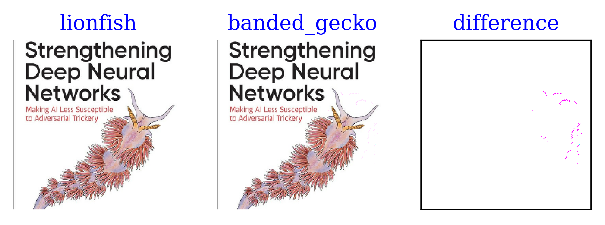

# strengthening-dnns

This is the code repository that accompanies the O'Reilly book 
[Strengthening Deep Neural Networks: Making AI Less Susceptible to Adversarial Trickery](https://learning.oreilly.com/library/view/strengthening-deep-neural/9781492044949/)

The Jupyter notebooks contained in this repository provide the illustrative examples to accompany the book.
There are many other resources (open libraries, examples and 
papers) available to explore adversarial examples. Some are listed in [RESOURCES.md]()

## Setting up your environment

Instructions for setting up your enviornment to run the code are in [GETTING_STARTED.md](GETTING_STARTED.md)

## Repository Structure

The Jupyter notebooks in this repository are located in their relevant chapter folder.

* images: contains some photographs to get started with the examples
* models: saved TensorFlow models 
* resources: static resources used by the Jupyter notebooks

## Book Structure

Part 1: An Introduction to Fooling AI
* Chapter 1: Introduction
* Chapter 2: Attack Motivations
* Chapter 3: Deep Neural Network Fundamentals
* Chapter 4: DNN Processing for Image, Audio and Video

Part 2: Generating Adversarial Input
* Chapter 5: The Principles of Adversarial Input 
* Chapter 6: Methods for Generating Adversarial Perturbation

Part 3: Understanding the Real World Threat
* Chapter 7: Attack Patterns on Real World Systems
* Chapter 8: Physical World Attacks

Part 4: Defense
* Chapter 9: Evaluating Model Robustness to Adversarial Inputs
* Chapter 10: Defending Against Adversarial Inputs
* Chapter 11: Future Trends - Towards Robust AI

